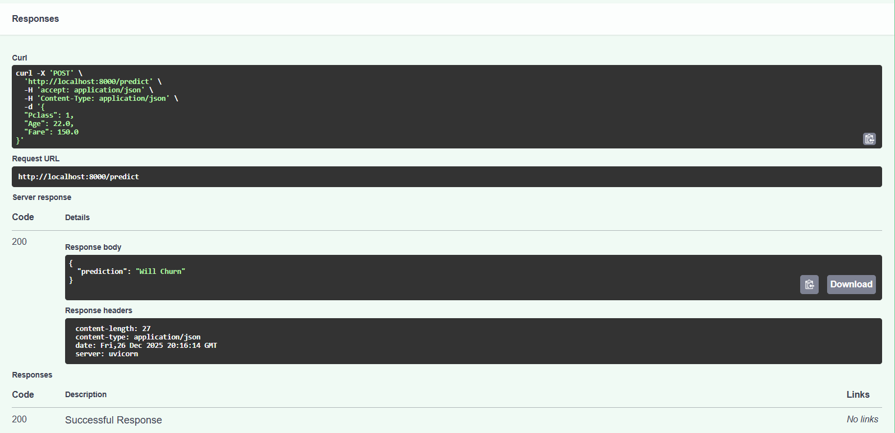

# 🚀 Customer Churn Prediction API (Microservice)

## 📌 Project Overview
This project transforms a trained Machine Learning model into a professional, scalable web service. By wrapping the model in a **FastAPI** framework and containerizing it with **Docker**, we ensure the model works consistently across any environment.

## 🛠️ Tech Stack
* **Languages:** Python
* **Libraries:** FastAPI, Pydantic, Scikit-Learn, Pandas, Uvicorn
* **DevOps:** Docker

## 🏗️ Architecture
* **Backend:** FastAPI (Python)
* **Model:** Random Forest Classifier (Previous Project logic)
* **Containerization:** Docker (Python 3.10-slim)
* **Documentation:** Automatic OpenAPI/Swagger UI

## 🧠 Model Origin
The `churn_model.pkl` used in this microservice was developed in my previous **[Churn Analysis Project](https://github.com/Rahilshah01/Customer-Churn-Analysis)**. In that project, I performed extensive Exploratory Data Analysis (EDA) and trained a Random Forest Classifier to identify patterns in customer behavior. This project focuses on the **deployment** phase of that model's lifecycle.

## 🧪 Live API Demonstration
Below is a real-time prediction captured from the interactive Swagger UI. The API successfully processes a "passenger" profile and returns a churn status in milliseconds.




## 🚀 How to Run Locally

### 1. Build the Docker Image
```
docker build -t churn-api .
```
### 2. Launch the Container
```
docker run -p 8000:8000 churn-api
```
### 3. Test the Endpoint
Navigate to ```http://localhost:8000/docs``` in your browser. Use the POST /predict endpoint.
